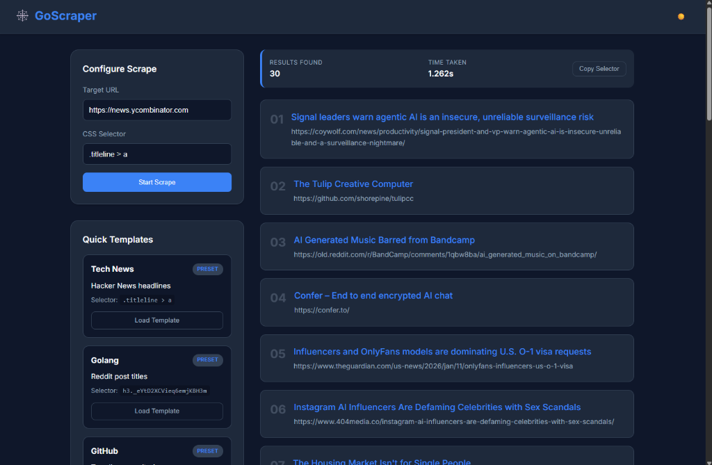

# 🕸️ Web Scraper in Go

A powerful, lightweight, and concurrent web scraper built with Go. Extract content from any website using CSS selectors through a modern web UI, a robust CLI tool, or a REST API.



---

## 🚀 What It Does

This tool allows you to scrape data from websites efficiently using **Go's concurrency primitives**. Whether you need to extract headlines from news sites, post titles from Reddit, or repository names from GitHub, this scraper makes it easy.

- **Concurrent Scraping**: Uses a worker pool to scrape multiple URLs simultaneously with controllable rate limits.
- **Web Interface**: A sleek, responsive dashboard with dark/light mode support.
- **CLI Power**: A dedicated `goscraper` command for terminal enthusiasts and automation.
- **REST API**: A JSON-based bulk scraping endpoint for programmatic integration.
- **Smart Extracts**: Automatically resolves relative links to absolute URLs.

---

## 🛠️ How to Run

### 1. Prerequisites
- **Go 1.21+** installed on your system.
- (Optional) **Docker** for containerized execution.

### 2. Local Setup
```bash
# Clone the repository
git clone https://github.com/GhanshyamJha05/WEB_SCRAPPER_Using-GO.git
cd WEB_SCRAPPER_Using-GO

# Install dependencies
go mod tidy
```

### 3. Running the Web Server
```bash
go run main.go
```
The server will start at [http://localhost:8080](http://localhost:8080).

### 4. Running the CLI
```bash
# Build the CLI
go build -o goscraper ./cmd/goscraper

# Single URL scrape
./goscraper scrape -url https://news.ycombinator.com -selector ".titleline > a"

# Bulk scrape (JSON output)
./goscraper bulk -selector "h2 a" https://github.com/trending https://news.ycombinator.com
```

### 5. Running with Docker
```bash
docker build -t web-scraper .
docker run --rm -p 8080:8080 web-scraper
```

---

## 📊 Sample Output

### CLI (JSON Format)
```json
[
  {
    "title": "Show HN: A new web scraper in Go",
    "link": "https://news.ycombinator.com/item?id=123456"
  },
  {
    "title": "Why Go is great for scraping",
    "link": "https://example.com/blog/go-scraping"
  }
]
```

### API Bulk Scrape Response
```json
{
  "total_batch_time_ms": 450,
  "results": [
    {
      "url": "https://news.ycombinator.com",
      "data": "Headline 1 | Headline 2 | Headline 3",
      "execution_time_ms": 210,
      "status": "success"
    }
  ]
}
```

---

## 🔍 Features

- ⚡ Real-time scraping via CSS selectors  
- 🌐 Predefined sites (e.g., Hacker News, Reddit Golang, GitHub Trending)  
- 🌙 Dark/Light theme toggle  
- 📋 Copy selector for quick reuse  
- 📜 History of recently scraped URLs  
- 🛠️ Multi-stage **Docker** image (distroless)  
- 📈 **Prometheus** metrics (`/metrics`) support in CLI  
- ✅ **GitHub Actions** CI for automated testing  

---

## ✨ Example Sites Powered
| Site            | Tag       | CSS Selector              |
|-----------------|-----------|---------------------------|
| Hacker News     | Tech News | `.titleline > a`          |
| Reddit Golang   | Golang    | `h3._eYtD2XCVieq6emjKBH3m`|
| GitHub Trending | GitHub    | `h2 a`                    |

---

## 🧰 Built With

- [Go](https://golang.org/) - Backend & CLI
- [goquery](https://github.com/PuerkitoBio/goquery) - CSS Selection logic
- [Prometheus](https://prometheus.io/) - Performance monitoring
- Vanilla CSS & HTML - Frontend UI

---

## 📝 License

MIT License  
© 2025 [Ghanshyam Jha](https://github.com/GhanshyamJha05)
